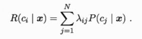
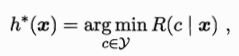
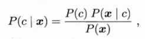
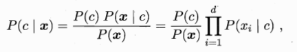
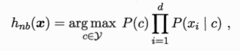
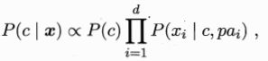
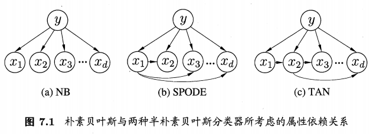

# 第七章 贝叶斯分类器

[TOC]

贝叶斯分类器是基于概率统计的分类器，使用最大概率来分类样本实例。

## 一：贝叶斯决策论

贝叶斯决策论是概率框架下实施决策的基本方法。对于分类任务来说，在所有相关概率都已知的理想情形下，贝叶斯决策论考虑如何基于这些概率和误判来选择最优的类别标记。

假设样本集 $\chi=(x1;x2;...;xd)$ ，有N种可能的分类标记，即 $\gamma=(c1,c2,...,cN)$ ，$\lambda ij$ 是将一个真实标记为 $cj$ 的样本通过 $h(x) $ 误分为 $ci$ 所产生的损失。即在样本x上的条件风险：

理想情况下，没有误分，即精度为100%，此时R为0。但分类总有误判，所以要找到一个判定准则 $h(x)$ 使误判的可能性最小，即最小化总体风险。显然，对于每个样本都要最小化条件风险：

此时，$h^{*}(x)$ 称为 **贝叶斯最优分类器** 。与之对应的总体风险 $R(h^{*})$ 称为 **贝叶斯风险** 。$1-R(h^{*})$ 反映了分类器所能达到的最好性能。贝叶斯分类器通过 **最小化分类风险** 来寻找最优的分类模型。

$\lambda ij$ 定义比较容易，P(c|x) 通常难以获得，但可以根据贝叶斯定理由P(x|c) 研究入手。

## 二：极大似然估计

即最有可能导致这个结果的概率估计。属于 **“模型已知，参数未知”** 的概率分析方法。详细理论见书中。

## 三：朴素贝叶斯分类

由贝叶斯决策接下来要讨论：P(c|x)。根据贝叶斯定理：

朴素贝叶斯做的是最简单的假设：**属性条件独立性假设** 。简言之，就是各属性相互独立，互不影响，这也是称为 **“朴素”** 的原因。这样贝叶斯公式就可以展开为：

因此，贝叶斯的判定准则为：

结合书中示例，方便理解朴素贝叶斯分类器工作原理。

## 四：半朴素贝叶斯分类器

朴素贝叶斯分类器采用了属性独立条件性假设，但现实任务中这个假设往往很难成立。于是，人们尝试对属性条件独立性假设进行一定程度的放松，因此产生了一类称为 **半朴素贝叶斯分类** 的学习方法。

半朴素贝叶斯采用 **“独依赖估计”** ，即假设每个属性在类别之外最多仅依赖于一个其他属性：

这里介绍了几种独依赖关系的选择，详细理论见书中。

## 五：贝叶斯网

针对更具普遍性的依赖关系。详细理论见书中。

## 六：EM算法

EM算法针对贝叶斯分类器数据缺失的情况。详细理论见书中。

