# 第三章 线性模型

[TOC]

本章介绍比较简单的监督学习模型——线性模型。线性模型的典型应用有两种 **线性回归** 和 **分类** 。线性回归主要解决一些拟合问题，关注的是 **线上** 问题，希望的测试结果和泛化结果尽量位于线上；而对线性回归使用sigmoid，则可以创建用于分类的线性模型，分类线性模型关注的是 **线侧** 问题，希望分类结果尽量位于线的两侧。

## 一：基本形式

给定由d个属性描述的示例：

$$x=(x1;x2;...;xd)$$ 

线性模型试图学得一个通过属性的线性组合来预测的函数：

$$f(x)=w1x1 + w2x2 + ... + wdxd + b$$ 

向量形式为：

$$f(x)=w^Tx + b$$

w直观地表达了各个属性在预测中的重要性，因此线性模型具有很好的解释性。

## 二：线性回归

显然，线性回归利用线性模型处理回归问题。给定数据集 $D={(x1,y1),(x2,y2),...,(xm,ym)}$ ，线性回归试图学得一个线性模型以尽可能准确地预测实值输出标记。

- **有序关系：** 对于有序的离散属性，可以转化为集合属性，例如“高”、“中”、“低”{1.0  0.5  0.0};
- **无序关系：** 对于无序关系可以采用向量值，例如“西瓜”、“南瓜”、“黄瓜”(0,0,1)、(0,1,0)、(1,0,0)。

### 2.1 二元线性回归

线性回归试图学得：

$$f(xi)=wxi + b，使得f(xi)≈yi$$

使用 **均方误差(对应欧式距离)** 作为性能度量：

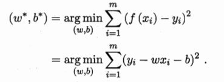

最小化均方误差，使用**最小二乘法** ：分别对w和b求导：

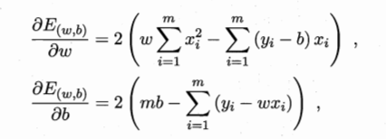

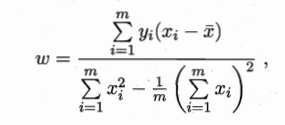

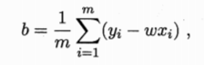

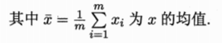

除了最小二乘，还可以选择梯度下降法等求解线性方程。

### 2.2 多元线性回归

更一般的情况，有多个属性(d)情况下，试图学得：

$$f(xi)=w^Txi + b，使得f(xi)≈yi。$$
$$
Y=
\begin{pmatrix}
y1\\ 
y2\\ 
...\\ 
ym
\end{pmatrix}
=
X * \hat{W}
=
\begin{pmatrix}
x11 & x12 & ... & x1d & 1\\ 
x21 & x22 & ... & x2d & 1\\ 
... & ... & ... & ... & 1\\ 
xm1 & xm2 & ... & xmd & 1
\end{pmatrix}
*
\begin{pmatrix}
w1\\ 
w2\\ 
...\\ 
wd\\
b
\end{pmatrix}

$$
称为多元线性回归。均方误差：

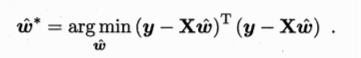

最小化均方误差：

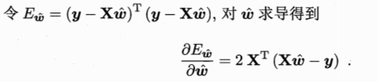

令上式为0，得最优闭解。

当 $X^TX$ 满秩：

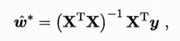

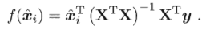

当$X^TX$不满秩，则由学习算法的归纳偏好决定，常见做法是引入正则化。

## 三：对数几率回归

线性回归模型产生的预测值是实值，做分类任务可以把线性回归的实值转化为0/1值，即由线上问题转化为线侧问题。最理想的是使用 **单位阶跃函数** ，即小于0时候判定为0；大于0时候判定为1。但单位阶跃函数不是连续可微的，所以寻找其他的单调可微函数 **g(·)** 作为阶跃函数的替代函数。

**对数几率函数** 在性质上最像单位阶跃函数，且单调可微：

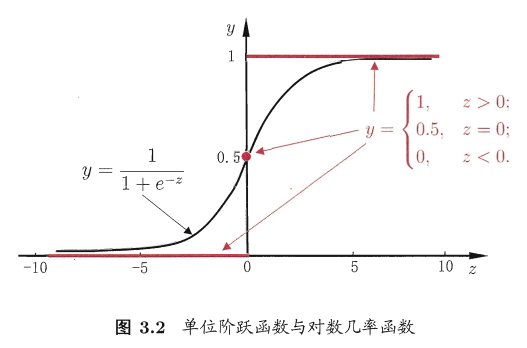

$$y=\frac{1}{1+e^{-z}}$$

将线性回归模型代入：

$$y=\frac{1}{1+e^-({w^{T}x+b})}$$

$$ln\frac{y}{1-y}=w^{T}x+b$$

$\frac{y}{1-y}$ 称为“几率”，反映了x作为正例的相对可能性。$ln\frac{y}{1-y}$ 为对数几率。

求解w和b：极大似然法->数值优化算法求解。详细参照书中。

## 四：线性判别分析(LDA)

线性判别分析(LDA)是一种经典的线性学习方法。LDA的思想非常朴素：给定训练样例集，设法将样例投影到一条直线上，使得同类样例的投影点尽可能接近、异类样例的投影点尽可能远离；在对新样本进行分类时，将其投影到同样的这条直线上，再根据投影点的位置来确定新样本类别。

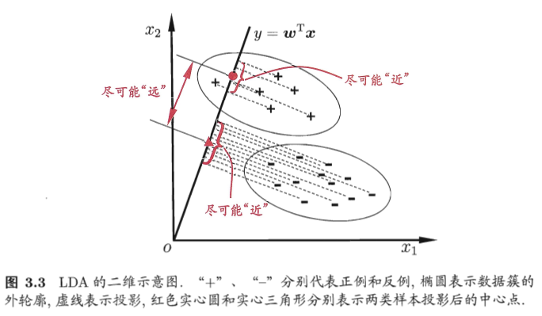

详细理论参照书中。

## 五：多分类学习

解决多分类问题的基本思想是划分为二分类问题。

- **一对一(OvO)：** 每个类别之间进行组合，需要训练N(N-1)/2个分类器，最终结果通过投票产生；
- **一对其余(OvR)：** 分为一类和其他类
- **多对多(MvM)：** 正反类构造器必须有特殊设计。常用技术“纠错输出码”。详情参考书中。

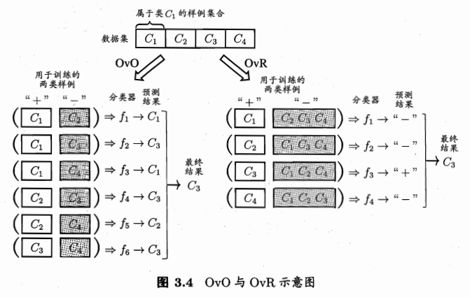

## 六：类别不平衡

实际应用中很可能出现类别不平衡的情况，例如OvR时。

几率 $\frac{y}{1-y}$ 反映了正例可能性与反例可能性的比值，阈值设置为0.5表面分类器任务真实正、反例可能性相同，即若 $\frac{y}{1-y} > 1$ 则预测为正例，否则为反例。在类别不平衡时，以m^+^ 表示正例，m^-^ 表示反例，观测几率 $\frac{m^{+}}{m^{-}}$ 代表实际几率，对阈值进行调整：

 $若 \frac{y}{1-y} > \frac{m^{+}}{m^{-}}，则预测为正例$

但真正决策时还是按照 $\frac{y}{1-y} > 1$ ，因此需要对它进行微调：

$$\frac{y'}{1-y'}=\frac{y}{1-y} * \frac{m^{-}}{m^{+}}$$

这就是类别不平衡时的基本策略——**再缩放** 。

