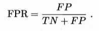

# 第二章 模型评估与选择

[TOC]

第二章介绍机器学习的常规流程和步骤，强调机器学习的关注点。通过介绍可以知道机器学习的大概流程，以及模型评价指标和优化方法。

本章首先介绍机器模型存在的过拟合和欠拟合情况，之后从如何处理数据、如何评价利用数据获得的模型、以及模型间优劣比较角度介绍了机器学习数据处理方法的步骤。

## 一：经验误差和过拟合

- 误差和精度：m个样本中有a个分类错误，则误差E=a/m，精度为1-a/m；
- 过拟合：学习能力太强大，把样本不太一般的特性都学到了，很难克服；
- 欠拟合：学习能力低下，比较容易克服。

## 二：如何划分输入数据

输入数据即历史数据，一般用于训练，但考虑到模型需要评估，所以得分割一部分数据作为评估使用，即：**数据集 = 训练数据 + 测试数据** 。此外，要获得泛化能力好的模型，但并不可能知道实际的泛化误差，因此可以把 **训练误差近似为泛化误差** 。

### 2.1 留出法

**数据集D = 训练集S + 测试集T** 。在S上训练出模型后，用T来评估其测试误差，作为对泛化误差的估计。

- 分层采样：保证S和T样本类型偏差不大；
- 若干次随机化划分、重复实验取平均值；
- 常规大约2/3~4/5样本用于训练，其余用于测试。

### 2.2 交叉验证法

**数据集D = D1 + D2 + D3 + ... + Dk ** 。数据集划分为大小相似子集，每次使用k-1个子集用于训练，余下那个用于测试，可获得k组训练/测试集，最终返回平均值。

- 子集大小相似，由分层采用得到；
- 多次划分取平均值；
- k通常取值是10，如果k=m，即每个样本为一组，则为**留一法** 。

交叉验证法其实更像是留出法的特例，只不过训练集和测试集的选择更加具有规律性。两者最好的做法都需要多次划分取平均值。

### 2.3 自助法

留出法和交叉验证法都会保留数据作为测试，这样可能造成训练的不准确性，自助法可以克服这个缺点。

**数据集D —> m次重复采样 —> 数据集D‘ ** 。对包含m个数据的数据集D进行m次采样，产生新的数据集D’ 。过程中，一个样本始终不被采到的概率为：

即初始数据集D中约36.8%的样本未出现在采样数据集D‘中，于是可以使用D’作为训练集，D\D'作为测试集。

- 采样放回；
- 改变了初始数据集的分布，会引入估计偏差。

### 2.4 调参

机器学习的最主要步骤了吧......模型选定后就需要确定模型的参数。注意对连续变量的处理：一般在范围内选择合适步长，即划分为离散变量去处理。

## 三：如何评价模型

如何评价模型好坏？如何评价模型的泛化能力？前面介绍的精度和错误率只是最基本的评价方式。

### 3.1 错误率和精度

错误率即划分错误的概率，精度为划分正确的概率。**错误率 + 精度 = 1** 。

连续变量的错误率和精度略。

### 3.2 均方误差

回归任务最常用的性能度量是均方误差。

### 3.3 查准率、查全率和F1

其中，**TP + FP + TN + FN = 样例总数** 。便于理解，关注的都是正-正例。

**查准率P：** 查准率即准确查找的有多少，即预测出的正例中，正确的有多少？因此，查准率表达：

**查全率R：** 查全率即全部查出的有多少，即全部实际的正例样本被正确查出的有多少？查全率表达：

查准率和查全率相互矛盾，"鱼和熊掌不可兼得"，但实际应用中关注度往往不同。

**P-R曲线：** 查准率和查全率曲线，即把所有样本按照算法置信度排列（最有可能为正例的排在最前面，最不可能为正例的排在最后面）；之后选择合适的阈值对样本进行划分，阈值前为正例，阈值后为反例；根据阈值选取不同绘制P-R曲线：

- 若一个学习器的P-R曲线被另一个学习器的曲线完全包住，则后者的性能优于前者；

- 若学习器的曲线发生交叉，则很难断言谁优谁劣；

- 通俗比较P-R曲线下面积大小，面积大的优；

- **平衡点(BEP)** 简化比较P-R曲线优劣；

- **F1度量** ：

  

  为了体现对查准率和查全率重视度不同，F1度量的一般形式Fβ：

  

  其中：β > 0度量了查全率对查准率的相对重要性；β = 1时退化为标准的F1；β > 1时查全率有更大影响；β < 1时查准率有更大影响。

对于有多个二分类混淆矩阵的情况，可以采取“宏查准率“、”宏查全率“和”宏F1“；也可以采用”微查准率“、”微查全率“和”微F1“的方案。

### 3.4 ROC和AUC

ROC曲线和P-R曲线很类似，也来源于混淆矩阵，但它使用的是 **真正例率(TPR)** 和 **假正例率(FPR)** 。

**真正例率(TPR)：** 实际的正例被正确预测出的有多少，表达为：

**假正例率(FPR)：** 实际的反例被正确预测出的有多少，表达为：

**ROC曲线：** ROC曲线和P-R曲线绘制类似，也是样本排列后取不同的阈值划分计算，ROC曲线下方面积称为AUC：

- 若一个学习器的ROC曲线被另一个学习器的曲线完全包住，则后者的性能优于前者；
- 若学习器的曲线发生交叉，则很难断言谁优谁劣；
- 通俗比较ROC曲线下面积，即AUC的大小，面积大的优。

### 3.5 代价敏感错误率和代价曲线

现实中不同类型的错误造成的后果不同，因此，可以给评价函数一个代价矩阵来表现不同错误的不同后果：

在计算时需要把这些代价考虑进去。例如，代价敏感错误率为：

也可也绘制可以体现出代价的ROC曲线，即代价曲线：

## 四：如何比较模型

通过上一节的方法可以衡量一个模型的好坏，但模型之间的比较就是拿上一节的性能衡量直接比较？并不是这样，模型间的比较复杂的多。使用 **假设检验** 比较方法可以推断出：若在测试集上观察到学习器A比B好，则A的泛化性能是否在统计意义上由于B，以及这个结论的把握有多大。

### 4.1 假设检验

**二项检验** 和 **t检验** ，验证在单个学习器上测试误差和泛化误差相似的合理性。

### 4.2 交叉验证t检验

针对”交叉验证法“进行的学习器比较检验方法。

### 4.3 McNemar检验

针对”留出法“进行的学习器比较检验方法。

### 4.4 Friedman检验和Nemenyi后续检验

针对一组数据集上多个算法进行比较的检验。

## 五：偏差与方差

使用测试集上的测试误差近似泛化误差属于实验估计的方法，其背后的理论依据可以使用 **偏差-方差分解 ** 来解释。

理论解释略。

参考：

[P-R曲线深入理解](https://blog.csdn.net/b876144622/article/details/80009867)

[ROC曲线与AUC值](https://www.cnblogs.com/gatherstars/p/6084696.html)

[机器学习之分类器性能指标之ROC曲线、AUC值](https://www.cnblogs.com/dlml/p/4403482.html)

