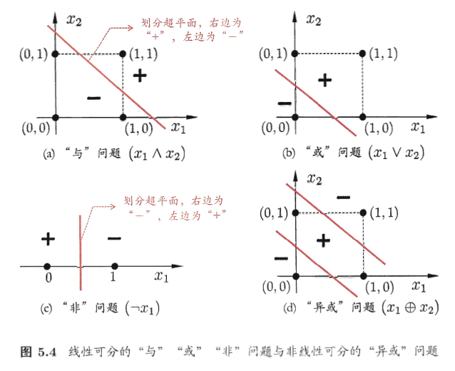

# 第五章 神经网络

[TOC]

本章介绍神经网络的基础知识。

## 一：神经元模型

神经元即神经网络的基础计算单元，神经网络就是由一级级神经元串联而成。单个神经元的计算能力类似对数几率线性模型，但多层神经元的计算能力相当强悍，基本可以模拟任何多项式。

最经典的M-P神经元模型如图所示，来源于生物神经元模型：

神经元接收到来自n个其他神经元传递过来的输入信号，这些输入信号通过带权重的连接进行传递，神经元接收到的总输入值将与神经元的阈值进行比较，然后通过“激活函数”处理以产生神经元的输出。

同样，最理想的激活函数是阶跃函数，但考虑到阶跃函数的不连续性和不可微，选取sigmoid函数作为激活函数：

## 二：感知机与多层网络

### 2.1 两层网络

感知机由两层神经元组成，能够很容易实现逻辑与、或、非运算。

- 与：令 $w1=w2=1,θ=2$ ，则 $y=f(1*x1+1*x2-2)$ 仅在 $x1=x2=1$ 时，y=1；
- 或：令 $w1=w2=1,θ=0.5$ ，则 $y=f(1*x1+1*x2-0.5)$ 当x1=1或x2=1时，y=1；
- 非：令 $w1=-0.6,w2=0,θ=-0.5$ ，则 $y=f(-0.6*x1+0*x2+0.5)$ 当x1=1时，y=0；当x1=0时，y=1。

把阈值θ看作一个固定输入为-1.0的“哑结点”，即归结到权重，这样权重和阈值的学习就可以归结到权重的学习:

这里使用微调的方式更新w权重，n称为学习率，若感知机对训练样本预测正确，即 $\hat{y}=y$ ，则感知机不发生变化，否则将根据错误的程度进行调整。同样的方法在使用梯度下降法的时候也有使用。

事实上，与、或、非问题都是线性可分的，感知机的学习能力非常有限，对于线性不可分的问题不能求解。对于线性不可分问题，需要考虑使用多层功能神经元。

### 2.2 多层网络

常见多层结构如图所示，每层神经元与下一层神经元全互联，神经元之间不存在同层连接，也不存在跨层连接。这样的神经网络结构通常称为“多层前馈神经网络”。

神经网络的学习过程，就是根据训练数据来调整神经元之间的连接权重以及每个神经元的阈值；把阈值归结到权重中则神经网络学的东西都蕴涵在 “连接权重” 之中。

## 三：误差逆传播算法

单层感知机学习算法显然不太使用多层网络，对于多层网络的经典算法是 **逆误差传播算法(BP)** 。

BP基于梯度下降算法更新迭代参数，具体理论推导见书中。学习率 $\eta\in(0,1) $ 控制着算法每一轮迭代中的更新步长， 太大容易震荡，太小收敛速度又会过慢。针对过拟合，可以采取 **早停** 和 **正则化** 等手段。

只需一个包含足够多神经元的隐层，多层前馈网络九年以任意精度逼近任意复杂度的连续函数。然而，如何设置隐层神经元的个数仍是个未解决的问题。

## 四：全局最小与局部极小

梯度下降过程最终会停止下降，即找到“最小值”。这个最小值是局部极小值，不一定是全局最小。

可采用以下策略“跳出”局部极小：

## 五：其他常见神经网络

- RBF网络
- ART网络
- SOM网络
- 级联相关网络
- Elman网络
- Boltzmann机

