# 第六章 支持向量机

[TOC]

“支持向量”到底是动词还是名词？应该是名词。支持向量机旨在找到一条容错性最好的划分平面，其根据与典型样本之间的“距离”来优化模型参数。支持向量机可以说是目前比较全面和广泛使用的监督学习算法，有相关开源库。

## 一：间隔与支持向量

做分类任务时，目的是找到一个划分超平面将不同样本隔开。但能将训练样本隔开的划分超平面可能很多，寻找最好的分隔超平面正是支持向量机模型研究的。

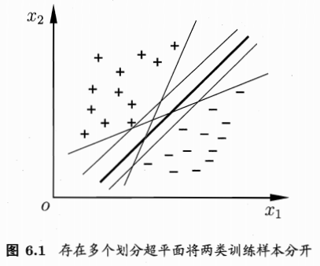

样本空间，划分超平面可通过如下线性方程来描述：

$$w^{T}x+b=0$$

其中 $w=(w1;w2;...;wd)$ 为法向量，决定了超平面的方向；b为位移项，决定了超平面与原点之间的距离。

将超平面记为 $(w,b)$ ，则样本空间任一点x到 $(w,b)$ 的距离为：

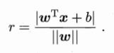

假设超平面 $(w,b)$ 能够将训练样本正确分类，即：

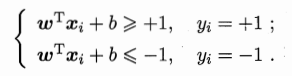

要关注的是距离超平面最近的几个样本点，它们可以使得上述等号成立，被称为 **支持向量** 。两个异类支持向量到超平面距离之和，即 **间隔** 为(**这里为什么选择间隔为1？或许是经验值，也或许是为了方便计算。**)：

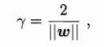

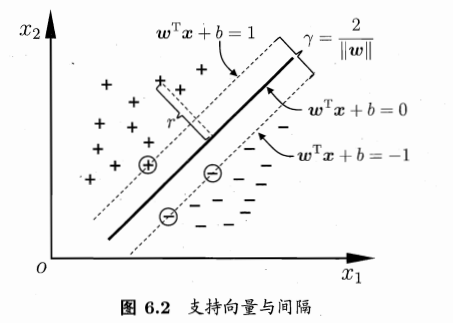

要找到最大间隔，即要确定  $(w,b)$ 使得 $\gamma $ 最大，而 $\gamma $ 最大仅需最大化 $||w||^{-1}$ ，等价于最小化 $||w||^{2}$ :

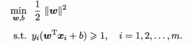

这就是 **支持向量机(SVM)** 的基本型。

## 二：对偶问题

求解上述的超平面 $(w,b)$。

- 凸二次规划问题，利用现成的优化计算包求解；
- 由拉格朗日乘子法求解对偶问题求解；SMO算法。

详细的理论介绍和推导见书中。

## 三：核函数

之前讨论都是假设样本是线性可分的，但实际中样本有时并非线性可分。通常针对线性不可分的情况采用 **升维** 方式，即将属性空间映射到一个更高维的空间；理论证明，只要原始空间是有限维的，总存在高维特征空间使样本可分。

令 $\phi(x)$ 表示将x映射后的特征向量，则超平面表达变为：

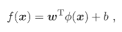

同样，最小化间隔并使用对偶问题求解，得到：

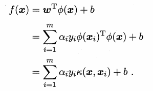

这里的 $k(·,·)$ 就是 **核函数** 。显然，若已知映射 $\phi(x)$ 的具体形式，则可以写出核函数。但通常 $\phi(x)$ 的形式并不知道，因此核函数的选择就至关重要。核函数选择必须满足 **《核函数定理》** ，常用的核函数有：

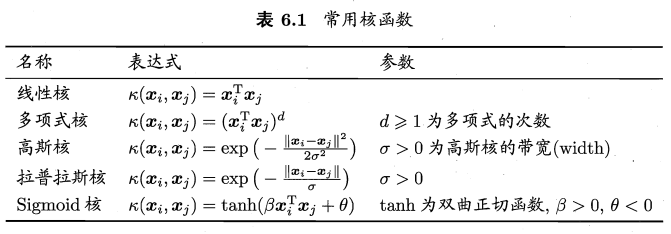

此外，还可以由它们的组合得到：

- 若k1和k2为核函数，则对于任意正数 $\gamma1,\gamma2$ ，其线性组合 $\gamma1k1 + \gamma2k2$ 也是核函数；
- 若k1和k2为核函数，则核函数的直积 $k1\bigotimes k2(x,z)=k1(x,z)k2(x,z)$ 也是核函数；
- 若k1为核函数，则对于任意函数g(x)，$k(x,z)=g(x)k1(x,z)g(z)$ 也是核函数。

总之，核函数是特征空间升维时使用，而升维是为了存在超平面让样本线性可分，之后可以使用SVM。

## 四：软间隔与正则化

上述讨论都假设间隔为 $\pm 1$ ，但未必真的存在超平面满足这样的间隔，即与支持向量可以保持这样的距离。缓解该问题的方法是允许支持向量机在一些样本上出错，因此引入 **软间隔** 的概念。

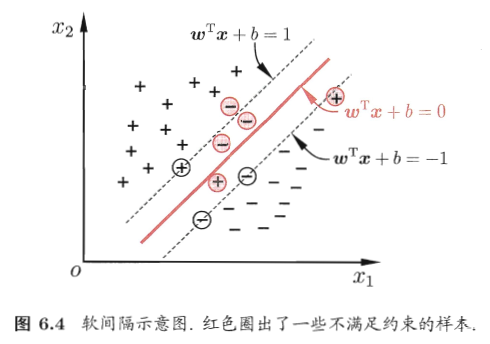

具体理论推导见书中。

## 五：支持向量回归

使用SVM优化回归问题，即 **SVR** 。

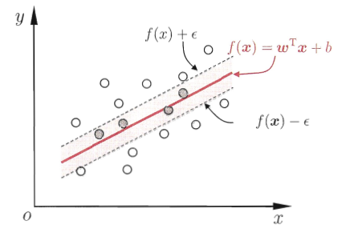

具体理论见书中。

## 六：核方法

见书中。

