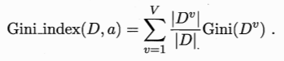
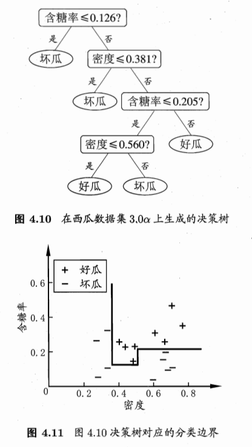

# 第四章 决策树

[TOC]


决策树主要解决二分类问题，其工作原理类似于生活中的“YES”or“NO”判断，判断成功则转到下一个判断，判断失败则输出FALSE结束判断。关于决策树形象的例子很多。

## 一：基本流程

决策树遵循“分而治之”思想，基于对问题的“YES”和“NO”判断使用递归算法逐层生成结点、叶等元素。一般的，一棵决策树包含一个根结点、若干个内部结点和若干个叶结点；叶结点对应于决策结果，其他每个结点则对应于一个属性测试；每个结点包含的样本集合根据属性测试的结果被划分到子结点中；根结点包含样本全集。

生成策略：


决策树返回情况：

- 当前结点包含的样本属于同一类别，无需划分；
- 当前属性集为空或所有样本在所有属性上取值相同，无法划分；设置为叶节点，类别设置为该结点所含样本最多的类别；
- 当前结点包含的样本集合为空，不能划分；标记为叶结点，类别设置为其父结点所含样本类别最多的类别。

其实很好理解：划分对象是样本集合，划分依据是属性，划分结果是类别；所以，样本集为空、属性无法再划分和类别都相同的情况都无需再继续处理了。

可见，整个过程比较重要的是第8行：**从A中选择最优划分属性a~*~ ** 。


## 二：划分选择

针对划分算法选择最优划分属性，即多个属性从中选择一个最合适的作为下次要划分的属性。这里介绍一些划分方法。

### 2.1 信息增益(ID3)

信息增益即“信息熵的增加”，因此需要了首先解信息熵：假设当前样本集合D中第k类样本所占比例为pk(k=1,2,...,|y|)，则D的 **信息熵** 定义为：


Ent(D)的值越小，则D的纯度越高。

假设离散属性a有V个可能的取值{a^1^, a^2^, ..., a^V^  }，数据集D按照属性a划分为{D^1^, D^2^, ..., D^V^}；则可以计算出划分后每个子集D^v^ 的信息熵，再赋予结点权重|D^v^|/|D|即样本数越多的分支结点的影响越大，可以计算用属性a对样本集D进行划分所获得的 **信息增益** ：


一般而言，信息增益越大，则意味着使用属性a来进行划分所获得的“纯度提升”越大。**信息熵是针对集合内部而言，可以看作集合属性；信息增益则相对父子集合而言，表示的是信息变化的度量。** 

使用信息增益划分大体流程：

```c++

数据集                    计算信息增益                             选择属性  

数据集D                   计算按属性a划分的信息增益a_gain
属性{a,b,...,k}           计算按属性b划分的信息增益b_gain           比较属性信息增益
                         计算按属性...划分的信息增益..._gain       选择最优划分属性
                         计算按属性k划分的信息增益k_gain
```

### 2.2 增益率(C4.5)

信息增益准则对可取值数目较多的属性有所偏好，为了减少这种偏好可能带来的不利影响，可以使用**C4.5决策树算法** 使用的 **增益率** 来划分最优属性：


称为属性a的“固有值”。属性a的可能取值数目越多(即V越大)，则IV(a)的值通常会越大。

增益率准则对可取值数目较少的属性有所偏好，因此C4.5算法并不是直接选择增益率最大的候选划分属性，而是使用了一个启发式：先从候选划分属性中找出信息增益高于平均水平的属性，再从中选择增益率最高的。

### 2.3 基尼指数(CART)

CART决策树使用 **基尼指数** 来选择划分属性。类似于信息熵定义，基尼值定义为：


直观来说，Gini(D)反映了从数据集D中随机抽取两个样本，其类别标记不一致的概率，因此，Gini(D)越小，则数据集D的纯度越高。

类似信息增益定义，属性a的 **基尼指数** 定义为：



在候选属性集合A中，选择使得划分后基尼指数最小的属性作为最优划分属性。


## 三：剪枝处理

剪枝处理用于解决决策树“过拟合”的情况，即学习能力太好，生成的枝叶有些多。剪枝分为：

- **预剪枝：** 在决策树生成过程中，对每个结点在划分前后进行估计，若当前结点的划分不能带来决策树泛化性能的提升，则停止划分并将当前结点标记为叶结点；
- **后剪枝：** 先从训练集生成一棵完整的决策树，然后从底向上对非叶结点进行考察，若将该结点对应的子树替换为叶结点能带来决策树泛化性能提升，则将该子树替换为叶结点。

所以剪枝的重点在于 **如何判断决策树泛化能力的提升。**

### 3.1 预剪枝

预剪枝步骤，根据划分原则选择最优属性，将要划分的最优属性做父结点：

1. 将父结点标记为所含训练样本例最多的类别，计算父结点的泛化精度；
2. 按属性分类，各子类标记为所含训练样本例最多的类别，计算各子类泛化精度；
3. 比较父类和子类泛化精度是否有提升，如有提升则准许划分，否则将该结点标记为叶结点，且置为所含训练样本例最多的类别。

详细例子参考书中：


### 3.2 后剪枝

后剪枝步骤，生成完整决策树，从下向上考察结点：

- 计算决策树的泛化精度；
- 将该结点标记为叶结点，重新计算决策树泛化精度；
- 比较之前决策树泛化精度和剪枝后的精度，如果有性能提升则允许剪枝。

详细例子参考书中：


## 四：连续与缺失值

### 4.1 连续值处理

连续属性可以采用离散化手段化为离散属性。最简单的是采用 **二分法** 。

将连续属性的所有取值按从小到大排列，选取这些值作为离散值。之后选取一个阈值，大于这个阈值的划分为 D^+^ ，小于这个阈值的划分为 D^-^ 。这个阈值最简单的选取方案是选择中点位置，但可以按照公式采用最优划分：


### 4.2 缺失值处理

缺失值处理详见书中。


## 多变量决策树

将决策树的d个属性看作d维空间，则决策树分类边界是 **轴平行** 的：



如果使用斜边划分则可以大大简化决策树模型，**多变量决策树** 正是解决这个问题的。多变量决策树的非叶结点不再是对某个属性，而是对属性的线性组合进行测试：


